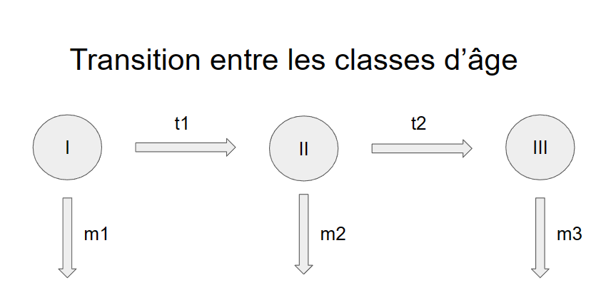

```{r setup, include=FALSE}
knitr::opts_chunk$set(echo = TRUE)
```

### Question 1

  1.A.
  
  Le modèle est déterministe, à compartiment et basé sur un temps discontinu.
  
  1.B. 
  
  Le processus biologique modélisé est une épidémie où les individus sont groupés en quatre catégories (sensible, infectés/non-infectieux, infectés/infectieux et rétabli/non-sensible) avec une présence en compte de la structure d'âge de la population (trois classes).
  
  1.C.
  
  FORMULE EN LATEX (si tu es chaud en LATEX, n'hésite pas !)
  
  
  1.D.
  
  {width=50%}
  {width=50%}
  
  
  1.E.
  1.F.
  1.G.
  
  1.H.
  
  K : Capacité de l'environnment. Valeur au-dessus de laquelle la population ne produit plus de portée.
  sr : Sex-ratio (proportion de femelles)
  portee : taille des portées
  m_i : mortalité intrasèque spécifique à la classe i
  f_i : fécondité de la classe i
  t_i : probabilité de partir de la classe d'âge i pour rentrer dans la classe i+1
  
  trans : probabilité d'infection (quitter le groupe des sensibles pour devenir infecté/non-infectieux)
  lat : probabilité de devenir contagieux (quitter le groupe des infectés/non-infectieux pour devenir infectés/infectieux)
  rect: probabilité de guérir (quitter le groupe des infectés/infectieux pour devenir guéri/non-sensible)
  loss : probalitité de perte d'immunité (quitter le groupe des guéri/non-sensible pour redevenir sensible)
  
  madd : probabilité de mourir pendant le stade infectés/infectieux
  
  2.
  
  cf. fichier functionModProjet2023 - OAT
  
  
  