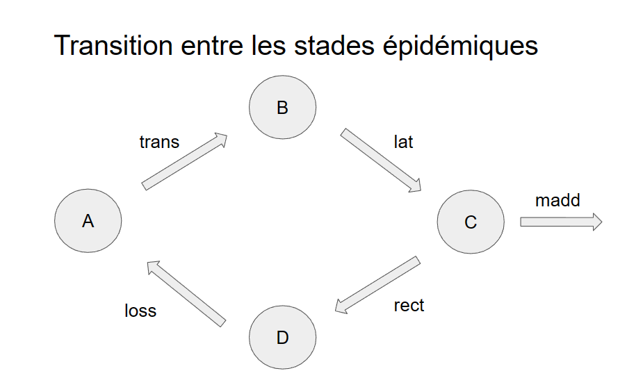
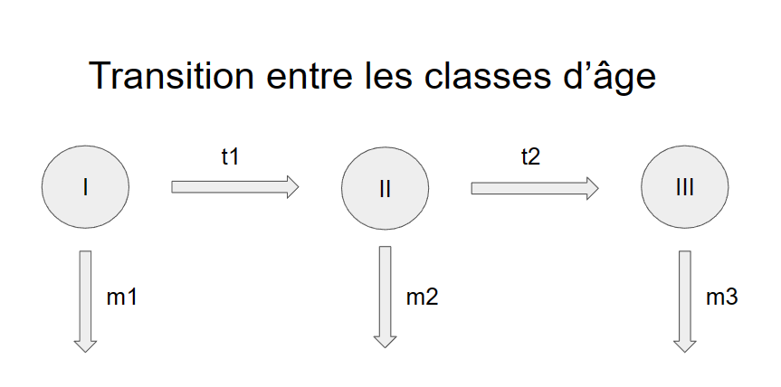

```{r setup, include=FALSE}
knitr::opts_chunk$set(echo = TRUE)
```

```{r, include=FALSE}
library(tidyverse)
library(ggpubr)
library(sensitivity)

source(file = "functionModProjet2023.r")
```


### Question 1

#### 1.A. Définissez le type de ce modèle
  
   Le modèle est :
  - **déterministe** puisque les résultats qu'il produit sont entièrement déterminés par les paramètres initiaux et les équations le décrivant, sans aucune composante aléatoire,
  - **à compartiment**, les individus sont groupés selon leur état de santé et leur classe d'âge,
  - **à un temps discret** car le temps (2 ans) est divisé en 730 jours au cours desquels les changements d'états du système ont lieux. 
  
 #### 1.B. Quels sont les processus biologiques en jeu ?
  
  Le grand processus biologique modélisé est une **épidémie**.
  
  Dans ce modèle, les individus sont groupés en quatre catégories selon le stade épidémique:  
  
  1- Les individus susceptibles, notés S. Ils sont susceptibles de se faire infecter. 
  
  2- Les individus exposés (infectés/non-infectieux), notés E ou L. Ils sont dans un état latent dans lequel ils sont infectés mais pas encore contagieux.
  
  3- Les individus infectés/infectieux, notés I. Ils sont infectés et contagieux. Cette classe a un risque de mortalité additionnel lié à la maladie.
  
  4- Les individus rétablis/non-sensible, notés R. Ils ne sont plus contagieux ni susceptibles d'être infectés. Ils peuvent malgré tout perdre leur immunité et redevenir susceptibles. 
  
  Ce modèle est donc un modèle SEIRS/SLIRS (Susceptible-Exposé/Latent-Infecté-Retiré-Susceptible). Les processus biologiques représentés à travers ce modèle correspondent aux transitions entre les états et sont la **transmission** de la maladie, le temps de **latence** entre l'exposition et l'état infectieux, la **mortalité due à la maladie** ou la **récupération/immunisation** après la maladie, et la **perte d'immunité**. A ces processus liés à la maladie s'ajoute des processus démographiques : **natalité** et **mortalité naturelle** (hors maladie). 
  
  En plus des états de santé, la population est structuré en classe d'âge ayant un taux de mortalité et de fertilité propre. 

  
#### 1.C. Ecrivez les équations associées
  
 Pour la classe d'âge 1 (enfant)
  $$\left\{ 
  \begin{array}{ll}
  S_{1}(t+1)= S_{1}(t).(1-m_{1}-t_{1}-\beta.\frac{\sum_{i=1}^{3}{I_{i}(t)}}{N(t)})+\xi.R_{1}(t)+SR.P.(N_{2}(t).f_{2}+N_{3}(t).f_{3}).(1-\frac{N}{K}) \\
   E_{1}(t+1)= E_{1}(t).(1-m_{1}-t_{1}-\sigma)+S_{1}(t).\beta.\frac{\sum_{i=1}^{3}{I_{i}(t)}}{N(t)} \\
    I_{1}(t+1)= I_{1}(t).(1-m_{1}-t_{1}-\mu-\gamma)+E_{1}(t).\sigma \\
     R_{1}(t+1)= R_{1}(t).(1-m_{1}-t_{1}-\xi)+I_{1}(t).\gamma
   \end{array}
  \right.$$
  Pour la classe d'âge 2 (adulte)
  $$\left\{ 
  \begin{array}{ll}
  S_{2}(t+1)= S_{1}(t).t_{1} + S_{2}(t).(1-m_{2}-t_{2}-\beta.\frac{\sum_{i=1}^{3}{I_{i}(t)}}{N(t)})+\xi.R_{2}(t) \\
   E_{2}(t+1)= E_{1}(t).t_{1} + E_{2}(t).(1-m_{2}-t_{2}-\sigma)+S_{2}(t).\beta.\frac{\sum_{i=1}^{3}{I_{i}(t)}}{N(t)} \\
    I_{2}(t+1)= I_{1}(t).t_{1} + I_{2}(t).(1-m_{2}-t_{2}-\mu-\gamma)+E_{2}(t).\sigma \\
     R_{2}(t+1)= R_{1}(t).t_{1} + R_{2}(t).(1-m_{2}-t_{2}-\xi)+I_{2}(t).\gamma
   \end{array}
  \right.$$
  Pour la classe d'âge 3 (senior)
  $$\left\{ 
  \begin{array}{ll}
  S_{3}(t+1)= S_{2}(t).t_{2} + S_{3}(t).(1-m_{3}\beta.\frac{\sum_{i=1}^{3}{I_{i}(t)}}{N(t)})+\xi.R_{3}(t) \\
   E_{3}(t+1)= E_{2}(t).t_{2} +  E_{3}(t).(1-m_{3}-\sigma)+S_{3}(t).\beta.\frac{\sum_{i=1}^{3}{I_{i}(t)}}{N(t)} \\
    I_{3}(t+1)= I_{2}(t).t_{2} +  I_{1}(t).(1-m_{3}-\mu-\gamma)+E_{3}(t).\sigma \\
     R_{3}(t+1)= R_{2}(t).t_{2} +  R_{3}(t).(1-m_{3}-\xi)+I_{3}(t).\gamma
   \end{array}
  \right.$$
Avec
$N_{2}(t)=S_{2}(t)+E_{2}(t)+I_{2}(t)+R_{2}(t)$
$N_{3}(t)=S_{3}(t)+E_{3}(t)+I_{3}(t)+R_{3}(t)$
$K$ : capacité de charge du milieu
$SR$ : sex ratio dans la population
$P$ : taille des portées
$m_{i}$ : taux de mortalité naturelle dans la classe d'âge i
$f_{i}$ : taux de fécondité dans la classe d'âge i
$t_{i}$ : taux de passage de la classe d'âge i à la classe d'âge i+1
$\beta$ : taux de transmission de la maladie
$\sigma$ : inverse du temps de latence
$\gamma$ : taux de récupération
$\xi$ : taux de perte d'immunité
$\mu$ : taux de mortalité due à la maladie

  
#### 1.D. Fournissez le schéma des transitions entre états concordant avec ces équations
  
  {width=50%}
  {width=50%}

=> 1 seul schema avec tout
  
#### 1.E. Listez les hypothèses principales de ce modèle (quel type de force d’infection, population variable ou constante, etc)
  
  Dans ce modèle, par rapport à un modèle SIR classique on suppose ...
  
  dynamique des population


 - tous les individus peuvent se reproduire (absense de sexes)
 - les variations interindividuelles ne propriétés des individus ne dépendent que de leur classe d'âge
    - la probabilité de se reproduire et le taille des portées ne dépendent que de la classe d'âge
    - le succès de reproduction dépend de la densité de population uniquement à travers une capacité de l'environnment noté K
    - le probalité intrasèque de mortalité (non-spécifique à une maladie) ne dépend que de la classe d'âge
 - les processus de migration sont négligés i.e. la population est considérée comme fermée


 dynamique épidémiologique
 
 - les propriétés épidémiologiques des individus sont identiques pour les individus, notamment qu'ils ne dépendent pas de la classe d'âge.
 - l'épidémie est structuré en quatre groupes: les sensibles, les latents, les infectieux et les guéris.

  
  
  
  
#### 1.F.
  
  Les conditions initiales du modèle sont :
    27 individus sensibles de classe d'âge 1
    23 individus sensibles de classe d'âge 1
    36 individus sensibles de classe d'âge 3
    1 individus infecté et infectieux de classe d'âge 3
  
#### 1.G.
  
  Les sorties proposés sont :
  
  1- la proportion de malades i.e. infectés (infectieux ou non) à la fin de la période d'étude (deux ans)
  
  2- le nombre d'infection réalisées le dernier jour de la période d'étude
  
  3- le nombre maximum de d'infectés pendant la période d'étude
  
  4- le nombre d'infection réalisés pendant la première année de l'étude
  
  D'autres sorties possibles du modèle peuvent être :
  
  5- la proportion maximale de malades pendant la période d'étude
  
  6- le nombre d'individus sensibles à la fin de la période d'étude
  
#### 1.H.
  
  K : Capacité de l'environnment. Valeur au-dessus de laquelle la population ne produit plus de portée.
  sr : Sex-ratio (proportion de femelles)
  portee : taille des portées
  m_i : mortalité intrasèque spécifique à la classe i
  f_i : fécondité de la classe i
  t_i : probabilité de partir de la classe d'âge i pour rentrer dans la classe i+1
  
  trans : probabilité d'infection (quitter le groupe des sensibles pour devenir infecté/non-infectieux)
  lat : probabilité de devenir contagieux (quitter le groupe des infectés/non-infectieux pour devenir infectés/infectieux)
  rect: probabilité de guérir (quitter le groupe des infectés/infectieux pour devenir guéri/non-sensible)
  loss : probalitité de perte d'immunité (quitter le groupe des guéri/non-sensible pour redevenir sensible)
  
  madd : probabilité de mourir pendant le stade infectés/infectieux
  
#### 1.I.

```{r, warning=FALSE, message=FALSE, echo=FALSE}
ValNominale = c(100, 0.5, 0.0014, 0.00029, 0.0019, 
                0.0019, 0.0082, 5, 1/365, 1/365, 
                0.3, 1/5, 1/20, 1/100, 0.001)


scenario_initial = matrix(ValNominale, nrow=1, ncol=15)

res = modAppli1(scenario_initial)


effectif = tibble(
       temps = 1:(2*365),
       
       S = res[[2]][4,1,],
       L = res[[2]][4,2,],
       I = res[[2]][4,3,],
       R = res[[2]][4,4,],
       
       N = S + L + I + R,
       
       C1 = res[[2]][1,1,] + res[[2]][1,2,] + res[[2]][1,3,] + res[[2]][1,4,],
       C2 = res[[2]][2,1,] + res[[2]][2,2,] + res[[2]][2,3,] + res[[2]][2,4,],
       C3 = res[[2]][3,1,] + res[[2]][3,2,] + res[[2]][3,3,] + res[[2]][3,4,]
       )


ggplot() +
  geom_line(data = effectif, aes(x = temps, y = S, color = "1- Susceptible"), linewidth = 1) +
  geom_line(data = effectif, aes(x = temps, y = L, color = "2- Latent"), linewidth = 1) +
  geom_line(data = effectif, aes(x = temps, y = I, color = "3- Infectious"), linewidth = 1) +
  geom_line(data = effectif, aes(x = temps, y = R, color = "4- Recovered"), linewidth = 1) +
  geom_line(data = effectif, aes(x = temps, y = N, color = "Population Size"), linewidth = 1) +
  labs(x = "Time", y = "Effectif") +
  theme_minimal() +
  ggtitle("Initial Model")


ggplot() +
  geom_line(data = effectif, aes(x = temps, y = C1/N, color = "First Age Class"), linewidth = 1) +
  geom_line(data = effectif, aes(x = temps, y = C2/N, color = "Second Age Class"), linewidth = 1) +
  geom_line(data = effectif, aes(x = temps, y = C3/N, color = "Third Age Class"), linewidth = 1) +
  scale_y_continuous(limits = c(0, 0.55)) +
  labs(x = "Time", y = "Effectif") +
  theme_minimal() +
  ggtitle("Initial Model")

```

  K
#### 2.A Justifiez les valeurs testées

#### 2.B. Fournissez votre script
  
```{r, warning=FALSE, message=FALSE, include=TRUE}
par_name = c("K", "sr", "m1", "m2", "m3", "f2", "f3", "portee", "t1", "t2", "trans", "lat", "rec", "loss", "madd")

ValNominale = c(100, 
                0.5, 0.0014, 0.00029, 0.0019, 
                0.0019, 0.0082, 5, 1/365, 1/365, 
                0.3, 1/5, 1/20, 1/100, 0.001)

scenario_OAT =  matrix(rep(ValNominale, each = 11), nrow = 11, ncol = 15)

graph_oat = function(i, bornes){
  
  scenario_OAT_i = scenario_OAT

  if (bornes[1] != Inf){
    inf = bornes[1]
    sup = bornes[2]
    i=2
    scenario_OAT_i[, i] = c(ValNominale[i],
                          inf + (sup-inf)  * c(0, 0.01, 0.1, 0.3, 0.4, 0.5, 0.7, 0.9, 0.99, 1)
                          )
  }
  else{
    scenario_OAT_i[, i] = ValNominale[i] * c(1,
                                             0, 1/100, 1/10, 1/5, 0.9,
                                             1.1, 2, 5, 10, 100)
  }
    sortie = modAppli(scenario_OAT_i)
    
    res_plot = tibble(paramettre_i = scenario_OAT_i[, i],
                  prop_inf = sortie[1]/sortie[1,1],
                  infec_end = sortie[2]/sortie[1,2],
                  nb_max_infec = sortie[3]/sortie[1,3] ,
                  nb_infec_year1 = sortie[4]/sortie[1,4])
    
    
    ggplot() +
      geom_line(data = res_plot, aes(x = paramettre_i, y = prop_inf, color = "S1"), size = 1) +
      geom_line(data = res_plot, aes(x = paramettre_i, y = infec_end, color = "S2"), size = 1) +
      geom_line(data = res_plot, aes(x = paramettre_i, y = nb_max_infec,  color = "S3"), size = 1) +
      geom_line(data = res_plot, aes(x = paramettre_i, y = nb_infec_year1,  color = "S4"), size = 1) +
      scale_x_continuous(trans='log10') +
      labs(x = "Parameter value", y = "Relative variation") +
      theme_minimal() +
      ggtitle(par_name[i])
}
```


```{r, warning=FALSE, message=FALSE, fig.dim = c(10, 7)}
ggarrange(graph_oat(i = 1, bornes = c(Inf, Inf)), graph_oat(i = 2, bornes = c(0, 1)), graph_oat(i = 3, bornes = c(0, 1)),
          graph_oat(i = 4, bornes = c(0, 1)), graph_oat(i = 4, bornes = c(0, 1)), graph_oat(i = 5, bornes = c(Inf, Inf)),
          graph_oat(i = 7, bornes = c(Inf, Inf)), graph_oat(i = 8, bornes = c(Inf, Inf)), graph_oat(i = 9, bornes = c(0, 1)),
          graph_oat(i = 10, bornes = c(0,1)), graph_oat(i = 11, bornes = c(0, 1)), graph_oat(i = 12, bornes = c(0, 1)),
          graph_oat(i = 13, bornes = c(0, 1)), graph_oat(i = 14, bornes = c(0, 1)), graph_oat(i = 15, bornes = c(0, 1)),
          ncol = 3, nrow = 5)


```
### 3. Analyse de sensibilité avec la méthode Morris

```{r}

par_name = c("K", "sr", "m1", "m2", "m3", "f2", "f3", "portee", "t1", "t2", "trans", "lat", "rec", "loss", "madd")
lowerValues = ValNominale*.75
upperValues = ValNominale*1.25

Morris <- morris(model = modAppli, 
                 factors = par_name, 
                 r = 50, 
                 design = list(type = "oat", levels = 6, grid.jump = 3),
                 binf=lowerValues,
                 bsup=upperValues)
```


a. Fournissez une figure équivalente à celle donnée dans le cours et interprétez-la. 

```{r}

plot(Morris)

# mu.star mesure la sensibilité 
mu.star <- apply(Morris$ee, 2, function(Morris) mean(abs(Morris)))
# sigma mesure interactions et relations non linéaires
sigma <- apply(Morris$ee, 2, sd)

Parametres <- c(rep("démographiques",10),rep("épidémiques",5))

ggplot(data=NULL,aes(x=mu.star,y=sigma,col=Parametres)) +
  geom_text(aes(label=par_name)) +
  scale_color_manual(values = c("darkblue","darkred")) +
  xlab(label="mu*") +
  ylab(label="sigma") +
  labs(title = "Analyse de Morris") +
  theme_minimal()
  

```

La plupart des paramètres ont une valeur de $\mu^*$ et de $\sigma$ très proche de 0, cela signifique que la variation de ces paramètres a peu d'influence sur la sortie du modèle. Seule la variation de 4 paramètres semble influencer les sorties du modèle de manière plus importante : lat, trans, loss et rec. 

3. b. Qu’en concluez-vous si vous comparez les deux approches et les résultats 
obtenus ?

### 4. Analyse de sensibilité globale avec la méthode FAST

*4.a. Identifiez et explicitez le package que vous utilisez pour cette analyse ; donnez les éléments les plus importants qui peuvent être modulés lors de cette analyse. Notamment, comment choisir le nombre de scénarios à réaliser ?*

*4.b. Réalisez un premier échantillonnage avec peu de scénarios par paramètre (100). Combien cela fait-il de simulations au total ?*

*4.c. Sauvegardez le tableau obtenu et réalisez un graphique illustrant les variations des paramètres obtenues.*

*4.d. Réalisez alors un second échantillonnage avec beaucoup de scénarios par paramètre (1000). De même, sauvegardez le tableau obtenu et illustrez graphiquement votre échantillonnage.*

*4.e. Comparez les deux échantillonnages et discutez des implications possibles.*

*4.f. Lancez le modèle sur ces deux échantillonnages en sauvegardant bien à chaque fois les valeurs des sorties dans chaque cas.*

*4.g. Visualisez la distribution des sorties obtenues : qu’en pensez-vous ? Quel impact dans le cadre d’une analyse de variance (telle que faite pour calculer les indices de sensibilité) ? Pouvez-vous donc interprétez toutes les sorties et pourquoi ?*

*4.h. Pour les sorties interprétables, calculez les indices de sensibilité principaux (effet principal) et d’ordre 1 (interactions deux-à-deux) et visualisez graphiquement les résultats.*

*4.i. Comparez les résultats des deux échantillonnages : qu’en concluez-vous ?*

*4.j. Interprétez biologiquement le cas à 1000 scénarios par paramètre.*

### 5. Discussion
*Les résultats sont-ils cohérents entre méthodes ? Quelles implications possibles ? Que feriez-vous ensuite en termes d’analyse de ce modèle ?*

